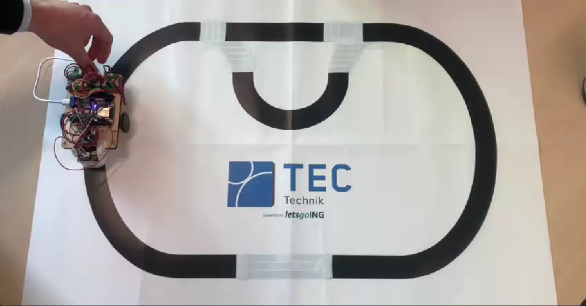
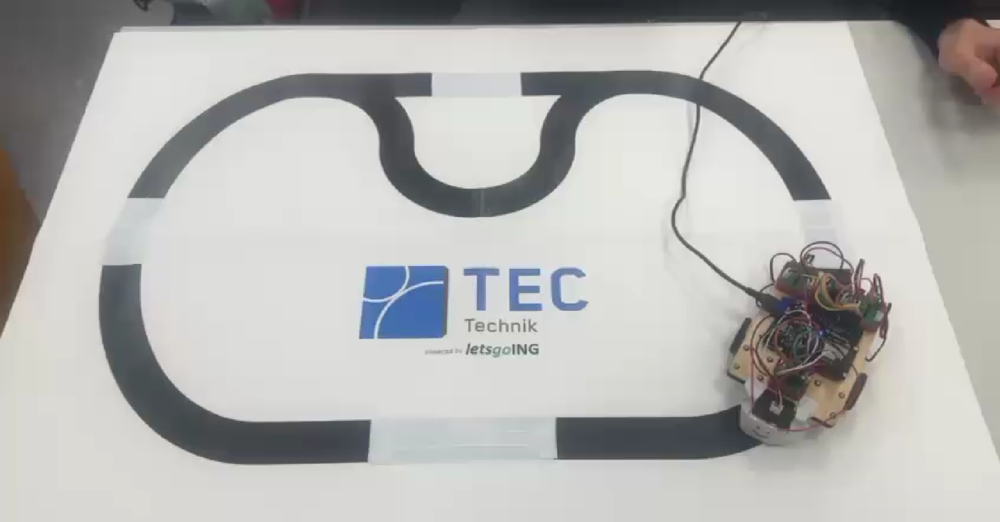

# Line following and gap crossing rover

This repository contains the main decision making logic I developed for a group project I took part in for university. It enabled the rover to stay on the black line and cross gaps within the track.

All necessary code to establish a bluetooth connection, initialise the pins on the ESP32 and the motor functions were provided for.

The rover uses an ESP32 to read two brightness sensors through analog to digital signal conversion. By testing the digital sensor values several times, a stable value for black was found and used as a threshold, on which a line-following logic was implemented: if both sensors detect black, the rover drives straight, and if one sensor detects white, it corrects its path with a curve.

The straight-crossing logic:

[]
(docs/videos/rover_straight_crossing.mp4)

The curved-crossing logic:

[]
(docs/videos/rover_curve_crossing2.mp4)

If crossing the gap takes too long, the rover identifies it as the biggest gap on the track and stores this information within a counter. When the counter reaches 2, the rover uses this gap to leave the track.
During the first 3.5 seconds, it counts left and right corrections to determine a global bias, which determines turning direction in which the track is driven. This bias is later used to decide in which direction the rover exits the track. After the exit process through the largest gap is concluded, the rover stays in an infinite sleep loop and must be restarted manually.

The connection between rover and smartphone was established via the Bluefruit Connect app, which provided a chat to read all outgoing messages and notifications.

